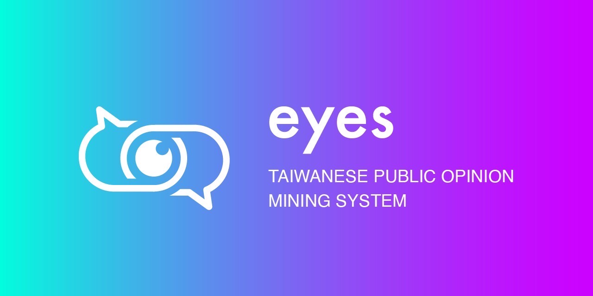
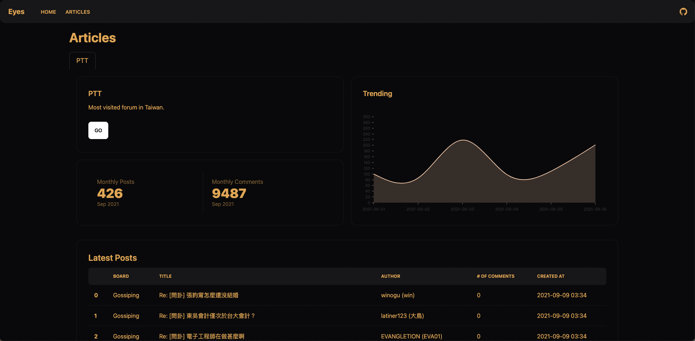
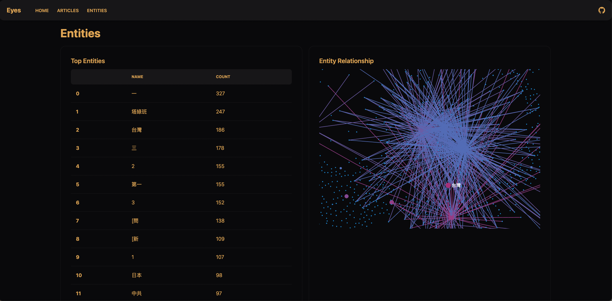
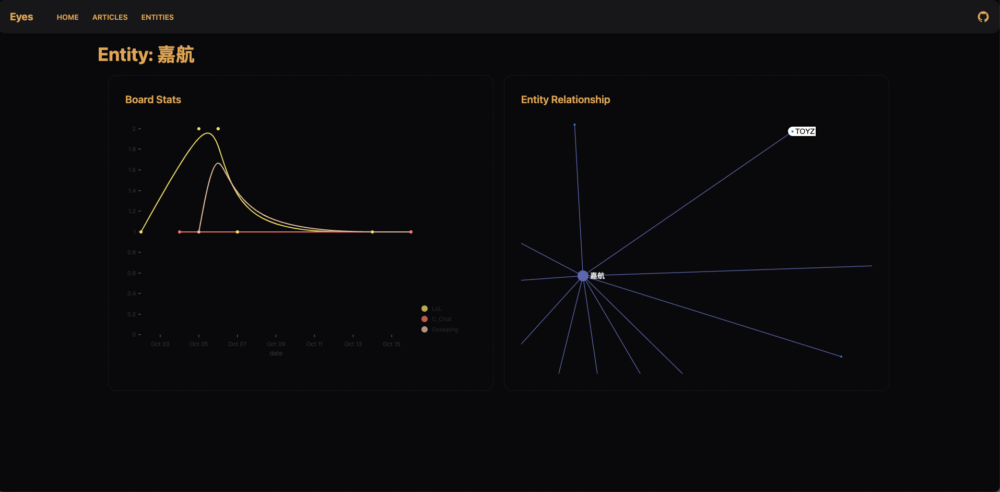
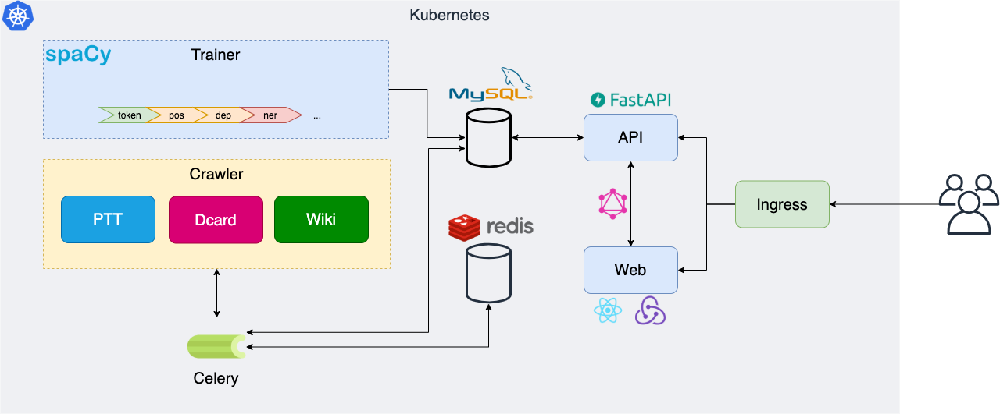

# 

eyes is a **Public Opinion Mining System** focusing on taiwanese forums such as [PTT](https://www.ptt.cc/bbs/hotboards.html), [Dcard](https://www.dcard.tw/f).

## Features

- :fire: **Article monitor**: helps you capture the trend at a glance.
- :fire: **Entity monitor**: helps you spy on a specific entity.
- :fire: **Weak supervision**: let you generate & update model without human effort.
- :fire: **Well-integrated with spaCy**: let you train models by yourself or use trained models in [model hub](https://spacy.io/models) simply.

## Screenshots

## Architecture

eyes system architecture

## Tech Stack

### Infrastructure

- Argo Workflows
- Celery, Flower
- Kubernetes, Helm Charts
- MySQL
- Redis

### API

- FastAPI
- SQLAlchemy ORM
- GraphQL

### Web

- React + Redux-Saga
- Tailwindcss

### ML

- spaCy
- skweak

## License

[MIT](./LICENSE)
